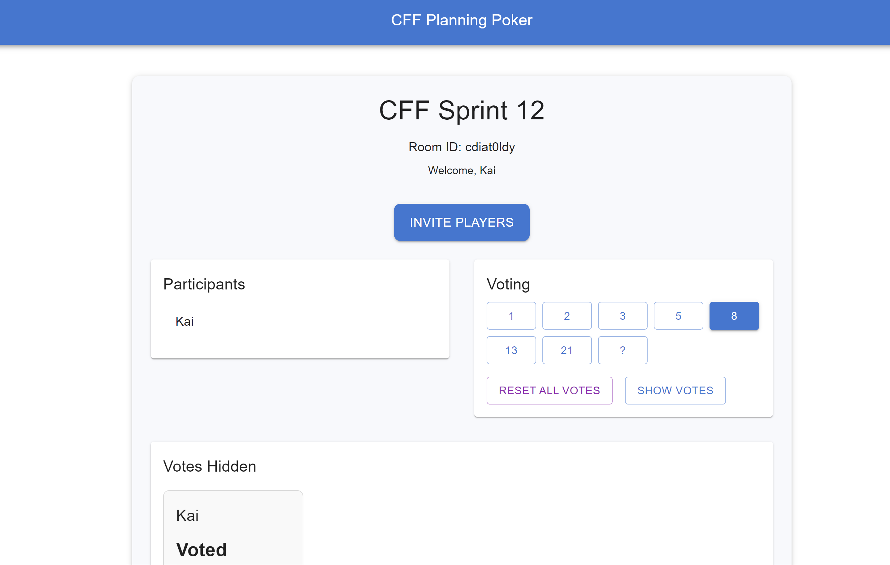

# Agile Poker Tool

## Description
This is an Agile Poker Tool application built with React, TypeScript, and Vite. It enables teams to conduct agile estimation sessions using planning poker.



## Current Issue
The application has a routing issue where refreshing the page or manually entering a URL does not work correctly. The routing only functions when navigating through buttons. This needs to be fixed for a better user experience. Fix upcoming in the next release.

## Technologies Used
- **Frontend:** React, Vite, Material UI
- **Backend:** Node.js, Express, Socket.IO
- **Package Manager:** pnpm

## Getting Started

### Prerequisites
Make sure you have `pnpm` installed. You can install it using the following command:
```bash
npm install -g pnpm
```

### Installation

1. Clone the repository:
    ```bash
    git clone https://github.com/Keyurx11/Agile-Poker-Tool.git
    ```
2. Navigate into the project directory:
    ```bash
    cd Agile-Poker-Tool
    ```
3. Install the dependencies for both frontend and backend:
    ```bash
    # In the root of your project
    pnpm install

    # In the frontend
    cd frontend
    pnpm install

    # In the backend
    cd ../backend
    pnpm install
    ```

### Running the Application

1. Navigate back to the project root:
    ```bash
    cd ..
    ```
2. Start both backend and frontend servers:
    ```bash
    pnpm run dev
    ```
3. Open your browser and go to `http://localhost:5173` to access the application.

### Contributing
Feel free to submit issues or pull requests for improvements or features.

### License
This project is licensed under the MIT License.
