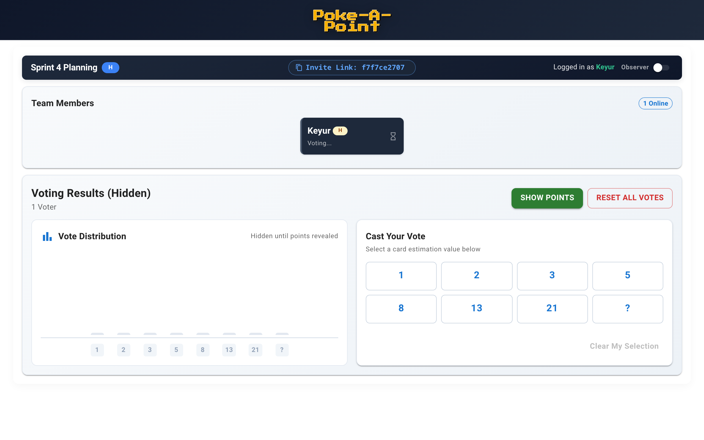

# Poke-a-Point

## Description

Poke-a-Point is an Agile estimation tool built with React, TypeScript, and Vite. It allows teams to conduct estimation sessions using planning poker, enhancing collaboration and improving estimation accuracy.



## Technologies Used

- **Frontend:**
  - React
  - TypeScript
  - Vite
  - Material UI
  - Socket.IO Client
- **Backend:**
  - Node.js
  - Express
  - TypeScript
  - Socket.IO
- **Package Manager:**
  - pnpm

## Key Features

- 🃏 **Multiple Estimation Deck Scales:** Choose between Standard Fibonacci (`1, 2, 3, 5, 8...`), Modified Fibonacci, T-Shirt Sizes (`XS, S, M, L, XL`), or create a fully custom deck.
- 👁️ **Observer / Voter Role Toggle:** Switch seamlessly between active voter and spectator/observer mode. Observers can follow along without affecting voting thresholds or blocking consensus.
- ⚡ **Real-time WebSockets & Auto-Reveal:** Powered by Socket.IO for zero-latency updates. Optional auto-reveal feature automatically flips cards the moment all voters finish casting.
- 📊 **Consensus & Statistical Breakdown:** Displays team average, consensus indicator badges, and a visual vote distribution chart once votes are revealed.
- 📋 **One-Click Invite Links:** Compact header pill with copy button allows quick team sharing via direct URL.
- 🔒 **Privacy First (In-Memory Only):** Zero data persistence. Room data and user votes exist strictly in memory for the duration of the session.
- 🎨 **Modern Dark-Mode UI:** Clean, responsive interface built with Material UI.

## Prerequisites

- **Node.js** (version 14 or higher)
- **pnpm** (package manager)

### Installing pnpm

```bash
npm install -g pnpm
```

## Installation

1. **Clone the repository:**

   ```bash
   git clone https://github.com/Keyurx11/Poke-a-Point.git
   ```

2. **Navigate to the project directory:**

   ```bash
   cd Poke-a-Point
   ```

3. **Install dependencies:**

   ```bash
   pnpm install
   ```

## Running the Application

### Development Mode

1. **Start both backend and frontend servers concurrently:**

   ```bash
   pnpm run dev
   ```

2. **Access the application:**

   Open your browser and navigate to `http://localhost:5173`.

### Production Mode

1. **Build the application:**

   ```bash
   pnpm run build
   ```

2. **Start the backend server:**

   ```bash
   pnpm run start
   ```

3. **Access the application:**

   Open your browser and navigate to `http://localhost:5000`.

## Scripts

### Root Scripts (`package.json` in root directory)

- **Start Development Servers:**

  ```bash
  pnpm run dev
  ```

  - Runs both frontend and backend in development mode with hot reloading.

- **Build Project:**

  ```bash
  pnpm run build
  ```

  - Builds both frontend and backend for production.

- **Start Backend Server:**

  ```bash
  pnpm run start
  ```

  - Starts the backend server from the built files.

## Deployment

Since the frontend is now served by the backend, you can deploy the entire application as a single service.

### Build and Start Commands for Deployment

- **Build Command:**

  ```bash
  pnpm install --prod=false && pnpm run build
  ```

- **Start Command:**

  ```bash
  pnpm run start
  ```

### Notes for Deployment

- **Environment Variables:**

  - No additional environment variables are needed for URLs, as the frontend and backend are served from the same origin.
  - Ensure any other necessary environment variables are set according to your deployment environment.

- **CORS Configuration:**

  - The backend is configured to allow requests from the same origin.

- **Serving Static Files:**

  - The backend serves the frontend build files from the `backend/dist/public` directory.

## Known Issues

- **Routing Issue:** Refreshing the page or manually entering a URL may cause routing issues due to client-side routing. This is resolved by the backend serving the `index.html` file for all unknown routes.

## Contributing

Contributions are welcome! Please open an issue or submit a pull request for any improvements or new features.

## License

This project is licensed under the MIT License.

## Acknowledgments

- Inspired by agile teams needing efficient estimation tools.
- Built with the help of open-source libraries and the developer community.

---

**Enjoy planning your sprints with Poke-a-Point!**